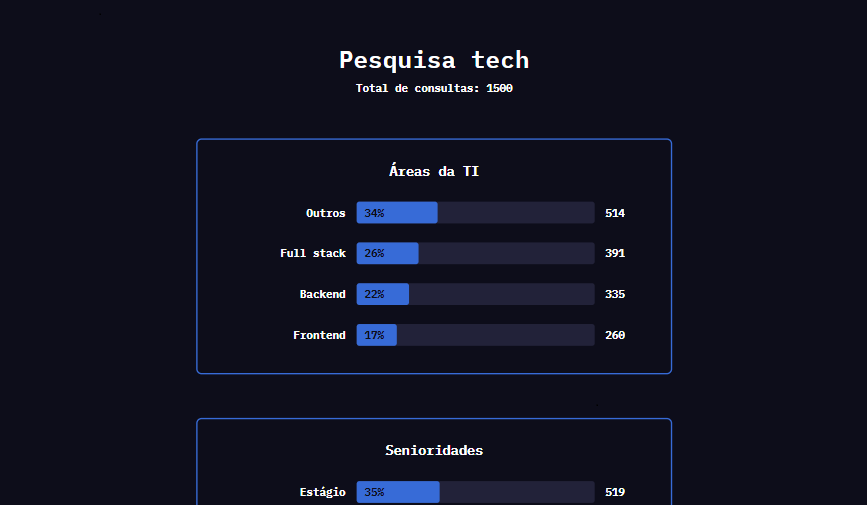

<div id="topo" align="center">

[![MIT License][license-shield]][license-url]

</div>

<br>

<div align="center">

  <h3 style="font-size: 32px; font-weight: 500">Pesquisa tech</h3>
  <p>Uma página que simula o resultado de uma pesquisa voltado para área de TI.</p>

  <h4> 🚧 Em desenvolvimento 🚧 </h4>

</div> 

<br>

<details>
    <summary>Conteúdo</summary>
    <br>
    <ul>
        <li> <a href='#-sobre-o-projeto'>Sobre</a> </li>
        <li> <a href='#-layout'>Layout</a> </li>
        <li> <a href='#-funcionalidades'>Funcionalidades</a> </li>
        <li> <a href='#-tecnologias'>Tecnologias</a> </li>
        <li> <a href='#-como-executar-o-projeto'>Como executar</a> </li>
        <li> <a href='#-autor'>Autor</a> </li>
        <li> <a href='#-licença'>Licença</a> </li>
    </ul>
</details>

## 💻 Sobre o projeto

 Comecei este projeto afim de estudar **React** e **TypeScript**. Nele desenvolvi uma página onde é mostrado o resultado de uma **suposta** pesquisa com desenvolvedores. 

 A pesquisa busca revelar alguns dados que poderiam ser obtidos ao questionar esses programadores sobre sua área de atuação, sua senioridade, salário, tempo de profissão e modalida de trabalho. O resultado é apresentado de forma quantitativa e através de graficos de barra.

 É importante ressaltar que os dados mostrados não são verídios. Pois são gerados aleatoriamente toda vez que a página é carregada. Mas futuramente pretendo inserir dados reais, que serão obtidos através de uma pesquisa realizada na própria página.
<br>

<p align="right"> <a href="#topo">⬆️ Voltar ao topo ⬆️ </a> </p>

***

<br>

## ⚙ Funcionalidades

 Na página se encontram **cinco** graficos de barras que apresentam em quantidade as seguintes informações:

<br>

- Áreas da TI 
    > **Frontend**, **Backend**, **Full stack** e **Outros**

- Senioridades 
    > **Estágio**, **Júnior**, **Pleno** e **Senior**

- Média de salario por nível 
    > **Frontend**, **Backend**, **Full stack** e **Outros**

- Tempo de profissão 
    > **menos de 1 ano**, **1 a 2 anos**, **3 a 5 anos**, **6 a 8 anos** e **mais de 8 anos**

- Modalidades 
    > **Presencial**, **Híbrido** e **Remoto**

<br>

<p align="right"> <a href="#topo">⬆️ Voltar ao topo ⬆️ </a> </p>

***

<br>

## 🎨 layout

O design desse projeto foi criado por mim no **Figma** e você pode acessa-lo através [deste link][figma-design-url].

<br>

<div align="center">
  
</div>

<br>

<p align="right"> <a href="#topo">⬆️ Voltar ao topo ⬆️ </a> </p>

***

<br>

## 🛠 Tecnologias

As seguintes tecnologias foram usadas na construção do projeto:

<br>

- Vite
- React
- TypeScript
- CSS

<br>

<p align="right"> <a href="#topo">⬆️ Voltar ao topo ⬆️ </a> </p>

***

<br>

## 🚀 Como executar o projeto

Para que a aplicação funcione na sua maquina você vai precisar ter instalado o [Git][git-url] e o [Node][node-url].

E após isso basta seguir os comandos:

```bash

# Clone este repositório
$ git clone https://github.com/MBrayanS/pesquisa-tech.git

# Instale as dependências e execute a aplicação em modo de desenvolvimento com
$ npm install
$ npm run dev

# Ou se você estiver usando yarn
$ yarn 
$ yarn run dev

# E no terminal irá aparecer a porta em que está rodando o projeto.

```

<br>

<p align="right"> <a href="#topo">⬆️ Voltar ao topo ⬆️ </a> </p>

***

<br>

## 🌠 Contribuição

Você deseja contribuir com o projeto e não sabe como?

- Faça um fork do projeto
- Crie uma nova branch para fazer suas alterações
- Salve as modificações e não se esqueça de usar o padrão de commit do projeto
- E por fim envie as suas alterações através de um pull request

Antes de começar uma nova feature ou uma correção de bug. De uma olhada em [issues][issues-url] para verificar se já não existe alguém trabalhando nisso. 

E caso tenha sobrado alguma dúvida, você pode entrar em contato [comigo](https://github.com/MBrayanS).

<br>

<p align="right"> <a href="#topo">⬆️ Voltar ao topo ⬆️ </a> </p>

***

<br>

## 👷 Autor

<table>
  <td align="center">
    <a href="https://github.com/MBrayanS">
      
      <br>
      <b> MBrayanS </b>
    </a>
  </td>
</table>

<br>

<p align="right"> <a href="#topo">⬆️ Voltar ao topo ⬆️ </a> </p>

***

<br>

## 📝 Licença

Este projeto esta sobe a licença [MIT][license-url].

<!-- Links de estilo de referência -->
<!--
    Estou usando "reference style" para deixar o arquivo mais legivel.
    https://www.markdownguide.org/basic-syntax/#reference-style-links
-->

[issues-url]: https://github.com/MBrayanS/pesquisa-tech/issues
[license-url]: https://github.com/MBrayanS/pesquisa-tech/blob/main/LICENSE
[figma-design-url]: https://www.figma.com/file/WCj20t9Rt7nVVl1ZPJdiaD/Pesquisa-Tech?type=design&node-id=0-1&mode=design&t=Hc9QpkXZm36AbwUQ-0
[git-url]: https://git-scm.com
[node-url]: https://nodejs.org/en

[license-shield]: https://img.shields.io/github/license/MBrayanS/pesquisa-tech.svg?style=for-the-badge